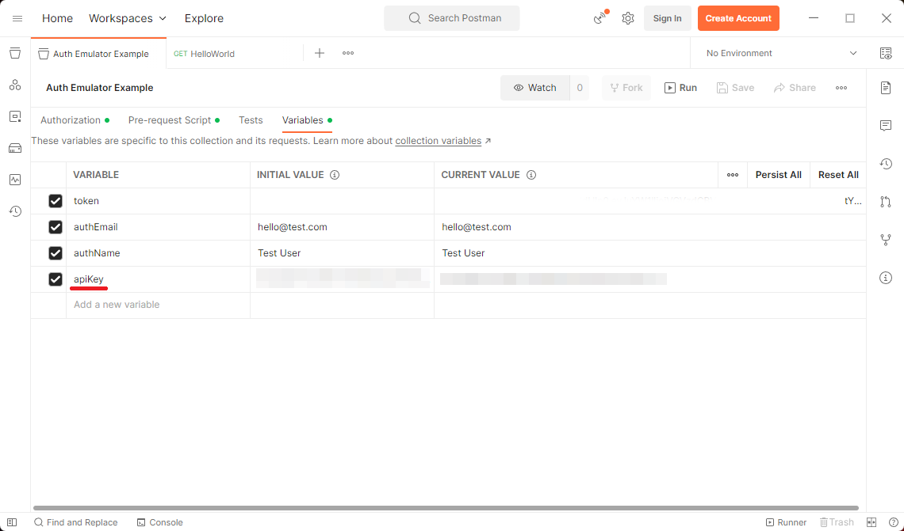
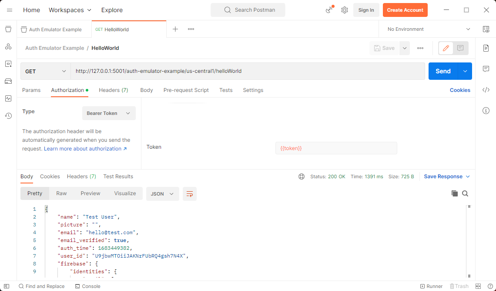

Firebase Authentication in Emulator Example
===========================================

This repository shows an example, of how to automatically create a valid `idToken` in Postman, before requests and use it as a bearer token.

The attached `PostmanCollection.json` executes a script which invokes the emulated Authenticatior api to create a user. The script is also available here: `postman/src/pre-request_script.ts`.

When you import the `PostmanCollection.json` into your Postman workspace you need to set the `apiKey`. (In order to have an `apiKey`, you need to create an `App` in Firebase).

You also need to generate and download the `serviceAccountKey.json` to the functions folder from the `Project settings`, `Service accounts` tab.

After this to setps, you should be able to run the `HelloWorld` method, which validates the token and returns the user data.

The created user should be visible in the [Emulator UI](http://localhost:4000/auth).